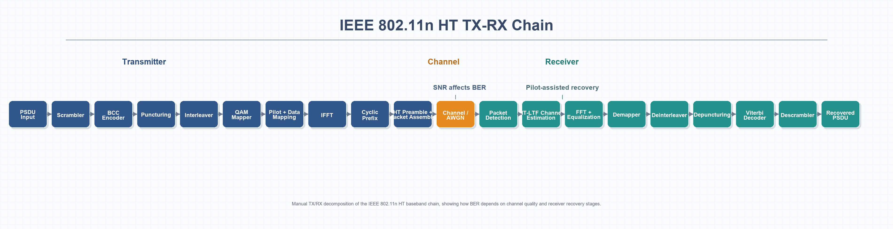

# IEEE 802.11 WLAN - Sıla Elif Karaağaç

This repository presents a student-focused IEEE 802.11 WLAN study built around OFDM fundamentals, BER-versus-SNR analysis, toolbox-based simulation, and a more detailed TX-RX chain decomposition in MATLAB.

## Information

End-to-end 802.11-like OFDM PHY simulation work in MATLAB, covering modulation, coding, BER behavior, AWGN-based performance analysis, and the transmitter-receiver chain used in IEEE 802.11n HT systems.

## Student Information

- **Name:** Sıla Elif Karaağaç
- **Department:** Electrical and Electronics Engineering
- **University:** Ankara Yildirim Beyazit University
- **Term:** 2026-2027

## Repository Structure

- `code/`: MATLAB scripts used for conceptual analysis, toolbox-based BER simulation, and detailed TX-RX chain implementation
- `reports/`: supporting reports and summary documents
- `assets/`: visual material used in the README

## Conceptual Map

This section introduces the communication logic behind OFDM before moving into toolbox-based and manual PHY implementation. It is designed to give a clear conceptual understanding of why BER changes with SNR, how modulation order affects robustness, and why OFDM is preferred in wireless systems exposed to noise and multipath.

### Summary

`ofdm_snr_ber_demo.m` is a compact MATLAB study focused on the BER-versus-SNR relationship. Its main purpose is to help the reader understand the SNR/BER logic by comparing simulated and theoretical BER for QPSK, 16-QAM, and 64-QAM over an 802.11a-style OFDM grid under AWGN.

`second-report-conceptual-overview.docx` expands the conceptual side of the project. It explains modulation choices, channel coding, AWGN effects, and the receiver-side recovery process, while framing OFDM as the physical-layer method that maps data to orthogonal subcarriers, inserts pilots, and uses FFT-based recovery.

### Included Files

- [OFDM SNR-BER Demo](./code/conceptual-map/ofdm_snr_ber_demo.m)
- [Second Report - Conceptual Overview](./reports/conceptual-map/second-report-conceptual-overview.docx)

## Toolbox-Based OFDM and Ready-Made Blocks

This section represents the stage where MATLAB WLAN Toolbox functions and ready-made communication blocks are used to obtain a practical IEEE 802.11n HT BER study. It shows how high-level toolbox components can quickly generate meaningful BER curves with less manual PHY implementation.

### Summary

`bersim_toolbox_ht_ber.m` is a toolbox-oriented BER simulation using `wlanHTConfig`, `wlanWaveformGenerator`, `wlanHTLTFDemodulate`, `wlanHTLTFChannelEstimate`, and `wlanHTDataRecover`. It sweeps SNR for multiple HT MCS values and plots BER, making it a ready-block reference for observing how modulation and coding affect system performance.

`third-report-toolbox-ber-study.docx` documents this stage in report form. It explains the transmitter-channel-receiver-analysis chain, clarifies why AWGN-only analysis was chosen for a more readable BER graph, and connects Simulink-style thinking to MATLAB toolbox execution.

### Included Files

- [Toolbox HT BER Simulation](./code/toolbox-simulation/bersim_toolbox_ht_ber.m)
- [Third Report - Toolbox BER Study](./reports/toolbox-simulation/third-report-toolbox-ber-study.docx)

## Detailed TX-RX Chain

This section presents the most explicit layer of the project: a manual TX-RX chain that exposes the IEEE 802.11n HT baseband blocks one by one. Instead of relying mainly on hidden toolbox abstractions, it makes the transmitter and receiver pipeline readable and inspectable.

### Summary

`txrx_manual_ht_chain.m` manually builds the path from PSDU generation through scrambling, BCC encoding, puncturing, interleaving, QAM mapping, pilot/data mapping, IFFT, cyclic prefix insertion, packet assembly, channel passage, packet detection, HT-LTF-based channel estimation, equalization, demapping, deinterleaving, depuncturing, Viterbi decoding, and descrambling. In short, it turns the TX-RX chain into a visible block-level implementation.

`ht-tx-rx-transition-summary.xlsx` summarizes the transition from ready-made toolbox blocks to a manual PHY chain. `tx-rx-chain-overview.png` provides a visual map of the same process, and `tx-rx-chain-notes.md` adds an English technical note that links the code structure to the communication flow.

### TX-RX Chain Overview

### Included Files

- [Manual HT TX-RX Chain Code](./code/tx-rx-chain/txrx_manual_ht_chain.m)
- [HT TX-RX Transition Summary](./reports/tx-rx-chain/ht-tx-rx-transition-summary.xlsx)
- [TX-RX Chain Notes](./reports/tx-rx-chain/tx-rx-chain-notes.md)
- [TX-RX Chain Overview PNG](./assets/tx-rx-chain-overview.png)
